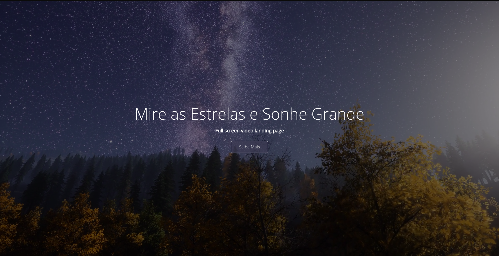

<h1 align="center">
    Full Screen Video Background
</h1>

<p align="center">	
  

  <a href="https://www.linkedin.com/in/yuripalacio/">
    
  </a>
  
  <a href="https://github.com/yuripalacio/full-screen-video-background/commits/master">
    
  </a>
  
  <a href="https://github.com/yuripalacio/full-screen-video-background/blob/master/LICENSE">
    
  </a>
</p>

<p align="center">
  <a href="#sobre">Sobre</a>&nbsp;&nbsp;&nbsp;|&nbsp;&nbsp;&nbsp;
  <a href="#video-background">Video Background</a>&nbsp;&nbsp;&nbsp;|&nbsp;&nbsp;&nbsp;
  <a href="#tecnologias">Tecnologias</a>&nbsp;&nbsp;&nbsp;|&nbsp;&nbsp;&nbsp;
  <a href="#referências">Referências</a>&nbsp;&nbsp;&nbsp;|&nbsp;&nbsp;&nbsp;
  <a href="#licença">Licença</a>
</p>

# Sobre

Em diversos sites encontramos video rodando ao fundo e isso proporciona um efeito muito legal.
Com isso em mente fiquei curioso para saber como reproduzir este efeito e aqui está o resultado.
Se trata de uma landing page bem simples porém com um vídeo executando em loop de fundo.

<h1 align="center">
    
</h1>

# Video Background

Para aplicarmos o vídeo ao fundo é algo muito simples.<br />
Dentro de uma div utilizamos a tag [video](https://www.w3schools.com/html/html5_video.asp) com algumas propriedades para execução automática, mudo e em loop.

``` html
<div class="video-container">
  <video src="video.mov" autoplay muted loop></video>
</div>
```
Para tornamos a execução do vídeo de forma responsiva, ou seja, para que o vídeo sempre seja executado no centro da tela, aplicamos as seguintes propriedades ao css.

``` css 
.video-container video {
  ...
  position: absolute;
  top: 50%;
  left: 50%;
  transform: translate(-50%, -50%);
}
```

Outro ponto importante é que para termos o texto a frente do vídeo, devemos atribuir um `z-index` ao conteúdo.

``` css 
.content {
  z-index: 1;
}
```

Podemos notar também que o vídeo estão mais escuro do que ele realmente é. Isso se deve ao fato de aplicarmos um efeito de rgba no `:after` do container de vídeo.

``` css
.video-container:after {
  content: "";
  position: absolute;
  top: 0;
  left: 0;
  width: 100%;
  height: 100%;
  background: rgba(0, 0, 0, 0.5);
}
```

# Tecnologias

- HTML
- CSS

# Referências

<p>
https://www.youtube.com/watch?v=Gx_7GQtSdpc
</p>

## Licença

Esse projeto está sob a licença MIT. Veja o arquivo <a href="https://github.com/yuripalacio/full-screen-video-background/blob/master/LICENSE">LICENSE</a> para mais detalhes.

<hr />

By [Yuri Palacio](https://www.linkedin.com/in/yuri-palacio/) :wave:
